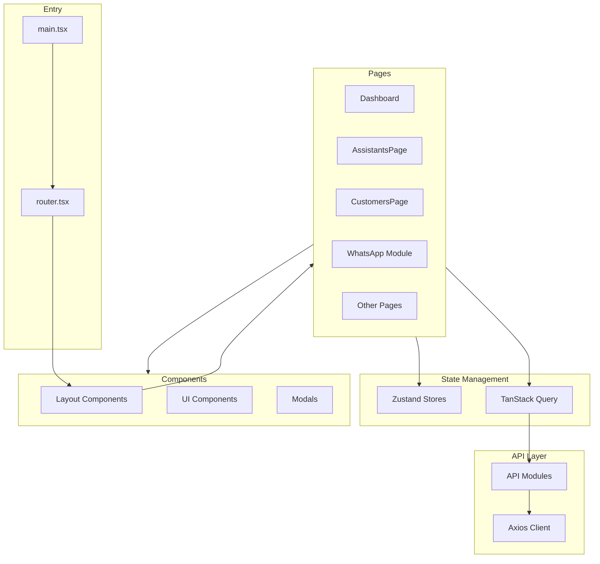
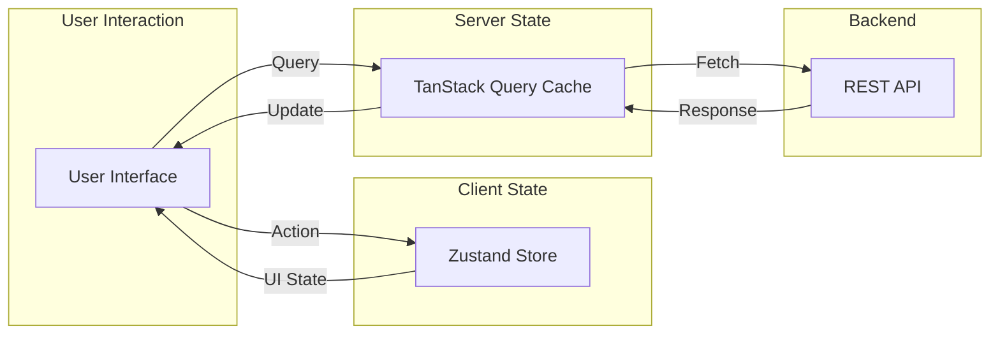

# Aloro Dashboard - Project Structure Assessment

## Overview

This is a **React 19** dashboard application built with modern tooling for managing AI assistants, WhatsApp flows, campaigns, and customer interactions. The project demonstrates solid architectural decisions with room for some improvements.

---

## Technology Stack

| Category | Technology | Version |
|----------|------------|---------|
| Framework | React | 19.2.0 |
| Build Tool | Vite | 7.3.1 |
| Language | TypeScript | 5.9.3 |
| Styling | Tailwind CSS | 4.2.1 |
| State Management | Zustand | 5.0.11 |
| Data Fetching | TanStack Query | 5.90.21 |
| Routing | React Router DOM | 7.13.1 |
| Flow Builder | XYFlow/React | 12.10.1 |
| Charts | Recharts | 3.7.0 |
| HTTP Client | Axios | 1.13.5 |

---

## Project Structure

```
src/
├── api/                    # API layer
│   ├── client.ts           # Axios instance with interceptors
│   ├── index.ts            # Barrel export
│   ├── assistants.ts       # Assistant-related API calls
│   ├── calls.ts            # Call-related API calls
│   ├── campaigns.ts        # Campaign-related API calls
│   └── services.ts         # General service functions
│
├── components/
│   ├── layout/             # Layout components
│   │   ├── Header.tsx
│   │   ├── Layout.tsx
│   │   └── Sidebar.tsx
│   ├── modals/             # Modal components
│   │   └── AssistantModal.tsx
│   └── ui/                 # Reusable UI components
│       ├── Badge.tsx
│       ├── KPICard.tsx
│       └── NotificationBell.tsx
│
├── lib/
│   └── utils.ts            # Utility functions
│
├── pages/                  # Page components
│   ├── Dashboard.tsx
│   ├── AssistantsPage.tsx
│   ├── CustomersPage.tsx
│   ├── CallsPage.tsx
│   ├── CampaignsPage.tsx
│   ├── KnowledgeBasesPage.tsx
│   ├── ToolsPage.tsx
│   ├── WebhooksPage.tsx
│   ├── InsightsPage.tsx
│   ├── PromptSnippetsPage.tsx
│   ├── WebWidgetPage.tsx
│   ├── PlaceholderPage.tsx
│   ├── index.tsx           # Barrel export with wrappers
│   └── WhatsApp/           # WhatsApp feature module
│       ├── index.ts
│       ├── WhatsAppPage.tsx
│       ├── tabs/           # Tab components
│       │   ├── FlowsTab.tsx
│       │   ├── SendersTab.tsx
│       │   └── TemplatesTab.tsx
│       └── builder/        # Flow builder feature
│           ├── FlowBuilderPage.tsx
│           ├── FlowBuilderCanvas.tsx
│           ├── FlowBuilderHeader.tsx
│           ├── LeftPanel.tsx
│           ├── RightPanel.tsx
│           └── nodes/      # Custom node components
│
├── stores/                 # Zustand stores
│   ├── index.ts
│   ├── ui.ts
│   ├── assistants.ts
│   └── whatsapp.ts
│
├── types/
│   └── index.ts            # All TypeScript types
│
├── main.tsx                # App entry point
├── router.tsx              # Route definitions
└── index.css               # Global styles
```

---

## Architecture Diagram



---

## Strengths

### 1. **Modern Technology Choices**
- React 19 with StrictMode enabled
- Vite for fast development and builds
- TypeScript throughout the codebase
- TanStack Query for server state management

### 2. **Clean Separation of Concerns**
- API layer isolated from components
- Types centralized in one file
- Stores separated by domain

### 3. **Feature-Based Organization**
- WhatsApp module is well-organized with its own subdirectory
- Flow builder has clear separation: canvas, header, panels, nodes

### 4. **Good State Management Strategy**
- Zustand for client state - UI, modals, sidebar
- TanStack Query for server state with sensible defaults: 5min stale time

### 5. **API Client Setup**
- Axios interceptors for auth token injection
- 401 handling with automatic redirect
- Configurable base URL via environment

### 6. **Routing Architecture**
- Hash router for static hosting compatibility
- Layout wrapper for consistent UI
- Full-screen routes for immersive experiences like Flow Builder

---

## Areas for Improvement

### 1. **Type Organization**
**Current**: All 355 lines of types in single [`index.ts`](src/types/index.ts)

**Recommendation**: Split into domain-specific files:
```
types/
├── index.ts          # Re-exports
├── assistant.ts      # SupportAgent, related types
├── whatsapp.ts       # WhatsAppSender, Flow, Node types
├── call.ts           # Call, Campaign types
├── tool.ts           # Tool, ToolParam types
└── common.ts         # Shared utility types
```

### 2. **API Layer Completeness**
**Current**: Some API functions in [`services.ts`](src/api/services.ts) but incomplete coverage

**Recommendation**: Create dedicated API modules:
```
api/
├── client.ts
├── index.ts
├── assistants.ts
├── calls.ts
├── campaigns.ts
├── whatsapp.ts       # NEW: WhatsApp senders, templates, flows
├── tools.ts          # NEW: Tools CRUD
├── webhooks.ts       # NEW: Webhooks CRUD
└── knowledge-bases.ts # NEW: KB operations
```

### 3. **Component Organization**
**Current**: Limited reusable components in [`ui/`](src/components/ui/)

**Recommendation**: Expand component library:
```
components/
├── ui/
│   ├── Button.tsx
│   ├── Input.tsx
│   ├── Select.tsx
│   ├── Modal.tsx
│   ├── Table.tsx
│   ├── Card.tsx
│   └── ...
├── layout/
│   └── ...
├── modals/
│   └── ...           # Consider generic Modal wrapper
└── shared/           # NEW: Shared feature components
```

### 4. **Store Organization**
**Current**: Missing store for WhatsApp feature despite having [`whatsapp.ts`](src/stores/whatsapp.ts)

**Observation**: The whatsapp store exists but is not exported from [`stores/index.ts`](src/stores/index.ts)

**Recommendation**: Ensure all stores are properly exported and consider domain-based store organization.

### 5. **Page Component Size**
**Current**: Some pages are quite large:
- [`ToolsPage.tsx`](src/pages/ToolsPage.tsx): 22,150 chars
- [`PromptSnippetsPage.tsx`](src/pages/PromptSnippetsPage.tsx): 19,893 chars
- [`CustomersPage.tsx`](src/pages/CustomersPage.tsx): 19,598 chars

**Recommendation**: Extract sub-components and hooks:
```
pages/ToolsPage/
├── index.tsx
├── ToolCard.tsx
├── ToolForm.tsx
├── ToolList.tsx
└── useTools.ts
```

### 6. **Missing Error Boundaries**
**Current**: No error boundary components visible

**Recommendation**: Add error boundaries for:
- Route-level error handling
- Component-level error isolation
- User-friendly error displays

### 7. **Environment Configuration**
**Current**: Only `VITE_API_URL` referenced

**Recommendation**: Add environment config file:
```typescript
// config/env.ts
export const config = {
  apiUrl: import.meta.env.VITE_API_URL || '/api',
  environment: import.meta.env.MODE,
  // Add other config as needed
};
```

### 8. **Testing Infrastructure**
**Current**: No test files visible in structure

**Recommendation**: Add testing setup:
- Vitest for unit tests
- React Testing Library for component tests
- Playwright/Cypress for E2E

---

## Data Flow Architecture



---

## Recommendations Summary

| Priority | Area | Action |
|----------|------|--------|
| High | Types | Split into domain files |
| High | API | Complete API module coverage |
| Medium | Components | Build reusable component library |
| Medium | Pages | Extract large page components |
| Medium | Stores | Ensure all stores exported |
| Low | Testing | Add test infrastructure |
| Low | Config | Centralize environment config |
| Low | Errors | Add error boundaries |

---

## Conclusion

The Aloro Dashboard project has a **solid foundation** with modern tooling and clear architectural patterns. The separation between API, state management, and UI layers is well-executed. The WhatsApp Flow Builder feature demonstrates good feature-level organization.

The main areas for improvement are:
1. **Scalability** - Splitting large files as the codebase grows
2. **Reusability** - Building a more comprehensive component library
3. **Maintainability** - Adding tests and better error handling

Overall, this is a well-structured React application that follows current best practices.
